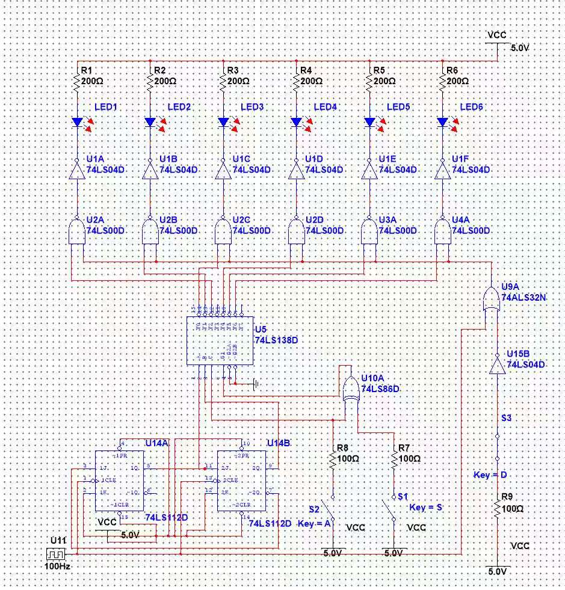
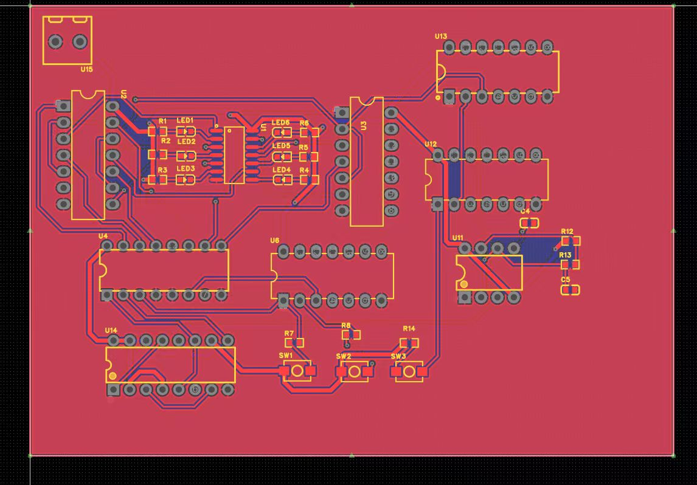

# 电子线路课程设计 · 汽车尾灯控制电路

电子线路课程设计：用 NE555 与 74LS 系列逻辑器件实现汽车尾灯的左/右顺序点亮与刹车闪烁，完成仿真、双层 PCB 与实物焊接调试。

## 功能

- **顺序点亮**：转向时左 / 右尾灯依次循环点亮
- **刹车闪烁**：刹车信号触发全部尾灯闪烁
- 基于 NE555 定时器 + 74LS 系列计数 / 逻辑电路搭建

## 技术栈

- 原理图 / PCB：立创 EDA（`.eprj2` 工程）
- 电路仿真：Multisim（`.ms14`）、Proteus（`.pdsprj`）
- 器件：NE555、74LS 系列、LED、电阻电容

## 目录结构

```
.
└── car-tail-light/                      # 汽车尾灯项目
    ├── 汽车尾灯.eprj2                   # 立创 EDA 专业版 PCB 工程
    ├── 汽车尾灯1.eprj2                  # 立创 EDA 工程（版本）
    ├── 汽车尾灯.ms14                    # Multisim 仿真
    ├── 汽车尾灯.pdsprj                  # Proteus 仿真
    └── images/                           # 原理图与 PCB 截图
```

## 说明

- `.eprj2` 文件需用立创 EDA 专业版打开
- `.ms14` 需用 NI Multisim 打开，`.pdsprj` 需用 Proteus 打开
- 课程任务书及参考报告不属于电路工程文件，已从当前仓库版本中移除

## 项目图




